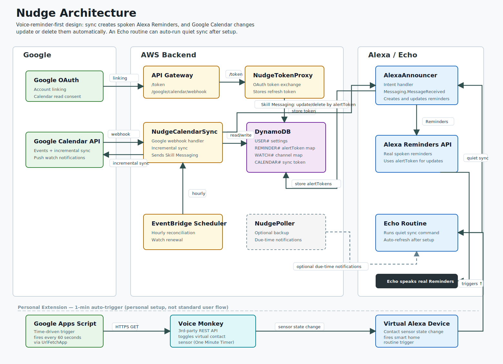

# Nudge

Nudge is an Alexa skill that turns Google Calendar events into spoken Echo
reminders.

The current product shape is:

- sync once to create real Alexa Reminders
- update or delete those reminders automatically when Google Calendar changes
- use one Echo routine to auto-run quiet sync for brand-new events

That makes the system practical as **automatic after one-time setup**, while
still staying inside Amazon's reminder API constraints.

## How It Works

The architecture is reminder-first:

```text
manual sync or quiet routine sync
  -> create real spoken Alexa Reminders
  -> store Google event -> Alexa alertToken mappings

Google Calendar changes later
  -> webhook + incremental sync
  -> update/delete existing Alexa Reminders automatically

brand-new event later
  -> picked up on next manual sync or Echo routine run
```

The important Alexa constraint is:

- new reminders must be created during an active skill session
- existing reminders can be updated/deleted later if we store `alertToken`

That is why Nudge uses both:

- active sync for creation
- background Skill Messaging for maintenance

## Recommended User Flow

Current intended setup:

1. Enable Nudge and link Google Calendar
2. Say:
   ```text
   Alexa, ask nudge to sync my calendar
   ```
3. Create one Alexa routine on the Echo device with this schedule:
   ```text
   7:00 AM
   ask nudge to run quiet sync
   wait 4 hours
   ask nudge to run quiet sync
   wait 4 hours
   ask nudge to run quiet sync
   wait 4 hours
   ask nudge to run quiet sync
   wait 4 hours
   ask nudge to run quiet sync
   ```

After that:

- new events are picked up on the next routine run
- changed events update existing reminders automatically
- deleted or silenced events remove existing reminders automatically

## Personal Extension: 1-Minute Auto-Trigger

For continuous personal use I layered a decoupled webhook pipeline on top of the
standard routine so quiet sync fires every 60 seconds without any local runtime:

```text
Google Apps Script (60-second time-driven cron)
  ──(HTTPS GET)──> Voice Monkey REST API
  ──(virtual sensor state change)──> Alexa smart home event
  ──> Echo routine fires "ask nudge to run quiet sync"
```

- **Google Apps Script** runs `UrlFetchApp.fetch()` on a 1-minute Time-driven
  trigger. Google's infrastructure acts as the cron daemon — the loop keeps
  running even when the local machine is off.
- **Voice Monkey** receives the authenticated GET request and toggles a virtual
  contact sensor (One Minute Timer) registered as an Alexa smart home device.
- **Alexa** detects the sensor state change and fires the Echo routine
  immediately, bypassing native routine throttle limits.
- **Security**: the webhook is one-way HTTP GET only. Voice Monkey cannot query
  local devices, camera streams, or credentials — it can only toggle the virtual
  switch.
- **Rate limit**: comfortably within Voice Monkey's free-tier cap of ~4 parallel
  requests per minute.

This is a personal setup and is not part of the standard user flow.

## Features

- Spoken Echo reminders from Google Calendar events
- Configurable default reminder timing
- Google event override reminder timing
- Google calendar default reminder timing
- Multiple calendars from one linked Google account
- Filters for:
  - all-day events
  - cancelled events
  - free/transparent events
  - `#silent` / `[silent]`
- Background update/delete of existing reminders
- Quiet sync intent for routines

## Architecture



More detail:

- [docs/visual-architecture.md](docs/visual-architecture.md)
- [docs/architecture.md](docs/architecture.md)

## Tech Stack

- Alexa Skills Kit
- Alexa Reminders API
- Alexa Skill Messaging
- Google Calendar API
- OAuth 2.0
- AWS Lambda
- DynamoDB
- API Gateway
- EventBridge
- CloudWatch
- Node.js

## Current V1 Direction

V1 is planned as:

- reminder-first Alexa skill
- automatic after one-time setup
- routine-based quiet sync for new events
- background update/delete for existing reminders

Strong near-term improvement:

- provider-side Alexa custom task support for a native `Nudge -> Refresh Calendar`
  action is implemented; final routine visibility still needs published-skill
  validation, so the custom-command routine remains the supported V1 path

## Limitations

- V1 supports multiple calendars from one linked Google account, not multiple
  separate Google accounts
- Brand-new reminders still need an active sync path; Amazon does not allow a
  normal custom skill to create brand-new spoken reminders fully out of session
- Proactive Events are not the main spoken reminder path and are currently not
  part of the recommended user setup

## Development Notes

- `NudgePoller` is still in the repo as an optional backup notification path,
  but it is not part of the main user flow
- the minute poller schedule is intentionally disabled
- log retention should stay short during development
- `skill-package/skill.json` intentionally uses placeholder Lambda ARNs in git;
  patch them locally before running `ask deploy --target skill-metadata`

## Links

- [Project page](https://masakazuyasumoto.com/projects/nudge)
- [Privacy policy](https://masakazuyasumoto.com/projects/nudge/privacy)
- [Support](https://masakazuyasumoto.com/projects/nudge/support)

For setup details, use:

- [docs/setup.md](docs/setup.md)
- [docs/deployment-checklist.md](docs/deployment-checklist.md)
