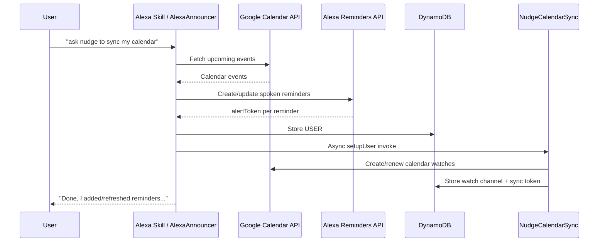
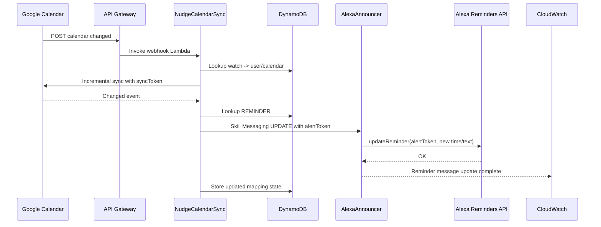
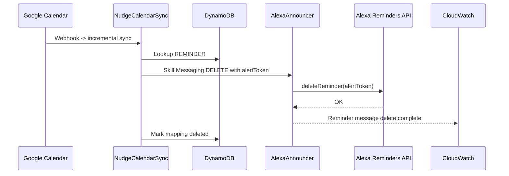
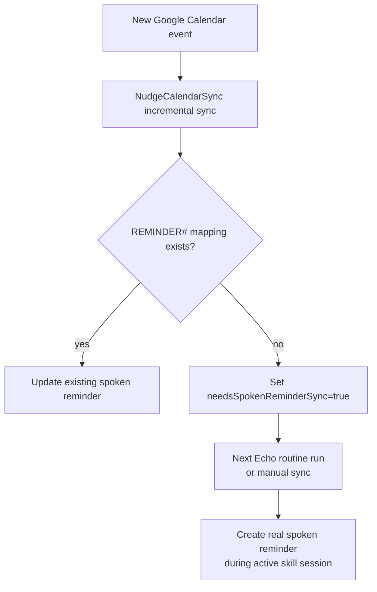
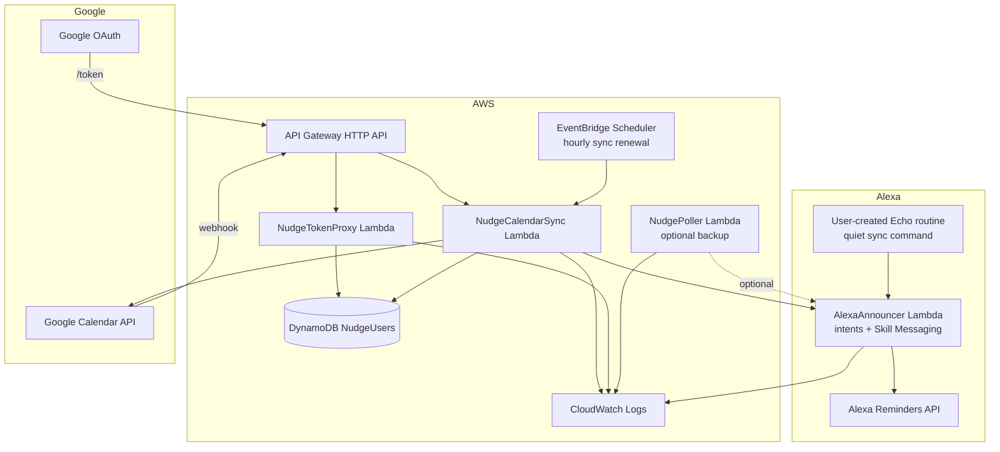

# Visual Architecture

This is the current voice-reminder-first architecture for Nudge.

The important product constraint is Amazon's Reminders API boundary:

- A skill can create new spoken Alexa Reminders during an active skill session.
- Existing reminders can be updated/deleted later by `alertToken` through Alexa Skill Messaging.
- A user-created Echo routine can invoke a quiet sync command on schedule, which
  gives Nudge a practical "automatic after one-time setup" flow.
- Alexa Proactive Events are not the core spoken reminder path and sync-nudge
  notifications are currently disabled.

## System Overview


The SVG above is the fastest way to explain the whole project. The Mermaid
diagrams below break down the same design by flow.

```mermaid
flowchart LR
  User[User] -->|says "ask nudge to sync my calendar"| AlexaSkill[Alexa Skill<br/>AlexaAnnouncer Lambda]
  Routine[Echo routine<br/>quiet sync command] -->|scheduled "ask nudge<br/>to run quiet sync"| AlexaSkill
  AlexaSkill -->|session Google access token| GoogleCalendar[Google Calendar API]
  AlexaSkill -->|create spoken reminders<br/>during active session| AlexaReminders[Alexa Reminders API]
  AlexaSkill -->|store settings + alertToken mappings| DynamoDB[(DynamoDB<br/>NudgeUsers)]
  AlexaSkill -->|async setup watches| CalendarSync[NudgeCalendarSync Lambda]

  GoogleCalendar -->|watch notification<br/>calendar changed| ApiGateway[API Gateway<br/>/google/calendar/webhook]
  ApiGateway --> CalendarSync
  CalendarSync -->|incremental sync| GoogleCalendar
  CalendarSync -->|read/write settings,<br/>sync tokens, reminder mappings| DynamoDB
  CalendarSync -->|update/delete existing reminder<br/>by alertToken via Skill Messaging| AlexaSkill
  AlexaSkill -->|update/delete existing reminder| AlexaReminders
```

## Main Spoken Reminder Flow

The user says sync once, and Nudge creates real spoken Alexa Reminders for the configured future window, currently 7 days by default.



The `REMINDER#...` mapping is the key record that makes later background maintenance possible:

```text
pk = USER#amzn1.ask.account...
sk = REMINDER#primary%3AgoogleEventId

alertToken = Alexa reminder token
eventIdentityKey = primary:googleEventId
summary = event title
eventStartTime = 2026-04-09T14:00:00.000Z
reminderTime = 2026-04-09T13:50:00.000Z
reminderMinutes = 10
timezone = America/New_York
```

## Existing Event Changed

This is the path we verified live. Moving a synced Google Calendar event updates the existing Alexa Reminder without another voice sync.



`NudgeCalendarSync` logs `Queued spoken reminder update...` because it can only prove the Skill Messaging request was accepted. `AlexaAnnouncer` logs `Reminder message update complete...` when the Alexa Reminders API actually accepts the update.

## Existing Event Deleted Or Silenced

If a previously synced event is deleted, cancelled, marked free, all-day, or tagged `#silent` / `[silent]`, Nudge deletes the existing Alexa Reminder by `alertToken`.



## Brand-New Event After Last Sync

This is the known platform gap. There is no existing `alertToken`, and Amazon does not support creating a brand-new spoken Alexa Reminder out of session for a normal custom skill.



Sync nudge notifications are currently disabled. The intended v1 path is that a
user sets one Echo routine and new events are picked up on the next routine run.

## DynamoDB Record Types

Single table: `NudgeUsers`

```text
USER#<alexaUserId> / SETTINGS
  Google refresh token, preferences, calendar IDs, sync flags

USER#<alexaUserId> / REMINDER#<encoded calendarId:eventId>
  Google event -> Alexa alertToken mapping

USER#<alexaUserId> / CALENDAR#<calendarId>
  Google Calendar sync token and watch metadata

WATCH#<googleWatchChannelId> / META
  Google webhook channel -> user/calendar lookup

EVENT#<userId>#<calendarId>#<eventId> / DUE
  Pointer to optional Proactive Event due bucket

DUE#YYYY-MM-DDTHH:mmZ / USER#...#CAL#...#EVENT#...
  Optional backup notification due bucket
```

## Runtime Components



## CloudWatch Log Control

CloudWatch logs are useful while the system is young, but they can become noisy and expensive if a webhook loops or a schedule runs too often.

Use these controls:

- Keep `NudgePollerEveryMinute` disabled unless testing backup Proactive Events due notifications.
- Keep `NudgeCalendarSync` on a low-frequency reconciliation schedule, for example hourly, plus Google webhooks.
- Set log retention on each Lambda log group to a short window during development, for example 7 or 14 days.
- Log only state transitions:
  - queued reminder update/delete
  - Reminder API update/delete completion
  - sync nudge sent
  - external API failures
- Do not log OAuth tokens, refresh tokens, full Alexa user IDs, or full event descriptions.
- Avoid per-event success logs for unchanged events. The sync code skips logging when a mapped reminder already matches.
- Add CloudWatch alarms later for error spikes on `NudgeCalendarSync` and `AlexaAnnouncer`, not for every successful invocation.

Recommended dev log retention:

```text
/aws/lambda/AlexaAnnouncer      14 days
/aws/lambda/NudgeCalendarSync   14 days
/aws/lambda/NudgeTokenProxy     14 days
/aws/lambda/NudgePoller         7 days, or disabled if poller is idle
```

## Certification And OAuth Notes

- Google push notifications require our public API Gateway webhook.
- Google OAuth app verification is needed before real public users. Development/test users can continue through the unverified-app warning.
- Alexa Proactive Events are notifications, not guaranteed spoken reminders.
- Spoken Alexa Reminder creation still requires an active skill session.
- Existing Alexa Reminders can be updated/deleted out of session because we store `alertToken` and use Alexa Skill Messaging.
